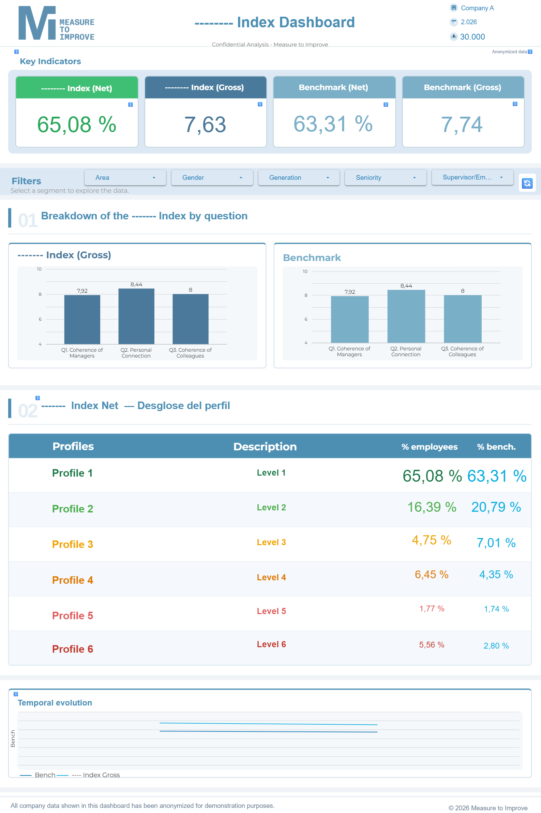
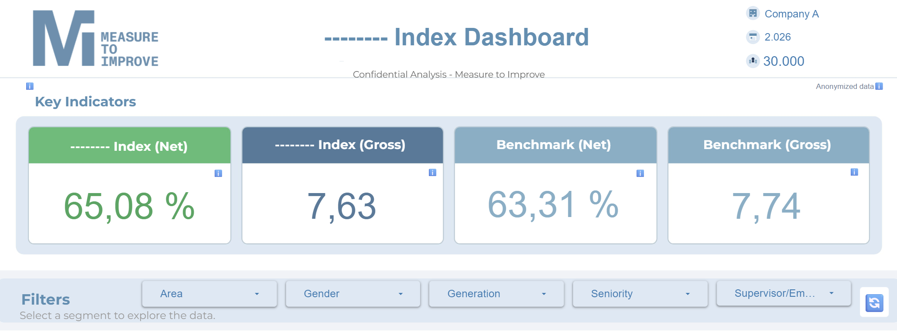
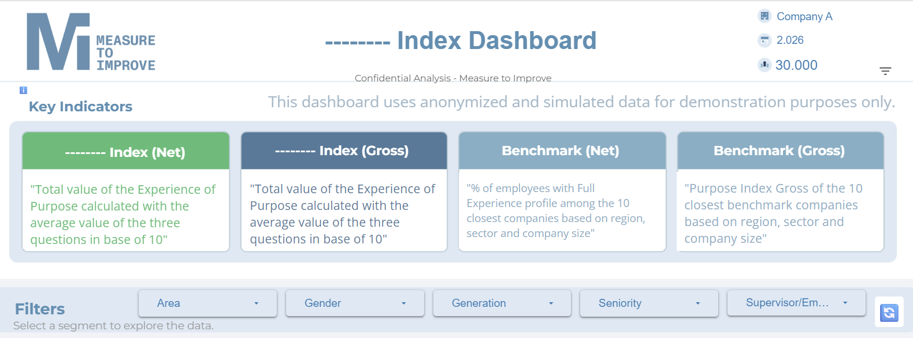
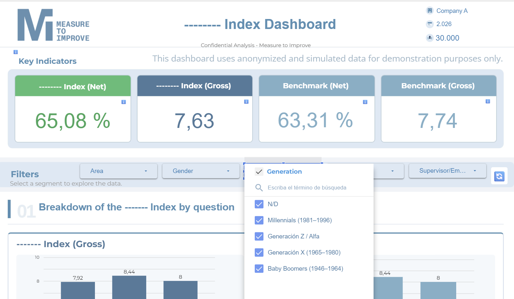
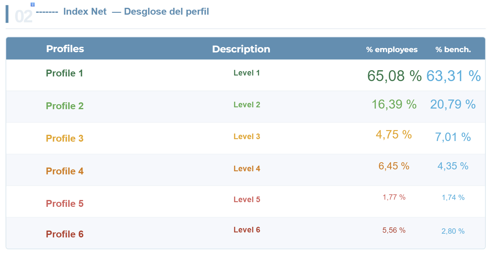
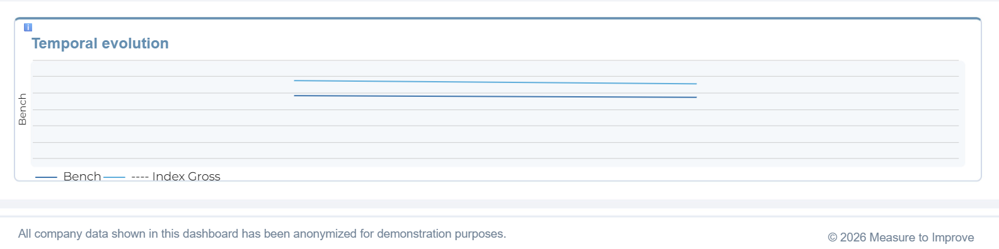

# 📊 Purpose Index Dashboard — Business Intelligence Platform

**Enterprise HR Analytics Platform** — Automated BI solution for measuring employee purpose and organizational alignment at scale.

     

🔗 [View Live Dashboard](https://datastudio.google.com/s/kg_Gf8wFY98)

*Company names, sectors, and all identifying information have been fully anonymized. Dataset size and scope are confidential.*

---



---

## 🎯 What I Built

A fully automated BI platform for Measure to Improve — a global movement born from 15+ years of academic research that helps companies measure the experience of purpose among their employees.

The movement spans 150+ companies, 300,000+ employees across 25+ countries and 15+ sectors. The platform was built to replace a manual, time-intensive reporting process with a single button click — architected to scale seamlessly as the movement continues to grow.

> *"From raw CSV to live interactive dashboard in under 5 minutes — zero manual intervention."*

| 📋 Records | 🏢 Companies | 🌍 Countries | 📊 Charts | ⚡ Speed | 🔒 Security |
|---|---|---|---|---|---|
| Anonymized | 150+ | 25+ | 50+ | < 5 min | Row-level |

---

## ⚙️ How It Works

```
1. Company distributes 3-question survey to employees
          ↓
2. Raw data uploaded to the platform
          ↓
3. Single button click triggers automated pipeline
          ↓
4. Script cleans, normalizes and transforms the full employee dataset
          ↓
5. KNN algorithm identifies peer organizations and calculates contextual benchmark
          ↓
6. Secure personalized dashboard ready in < 5 minutes
          ↓
7. Each client organization accesses an isolated, fully personalized dashboard —
   data separation is enforced at the infrastructure level, not the application layer
```

---

## 🏗 Architecture

```
Raw Survey Data (Input)
        │
        ▼
ETL Pipeline
  · Clean & normalize  ←  ARRAYFORMULA, IFS, REGEXMATCH, IFERROR
  · Auto-detect language  ←  ES / EN per country
  · Map sectors & companies
        │
        ▼
Processed Dataset
        │
        ▼
Benchmark Engine
  · Contextual benchmark calculated per company
  · Gross & Net metrics per question
        │
        ▼
Pivot Layer (multi-row per employee)
        │
        ▼
Google Looker Studio — 8 pages · 50+ charts · Real-time filtering
```

---

## 🧠 KNN Benchmark Algorithm

The platform calculates a contextual benchmark for each company using a custom KNN algorithm — identifying the most similar peer organizations across multiple dimensions and computing a weighted reference score. The benchmark is refreshed automatically on every pipeline run.

Below is a generic illustration of how a KNN matching structure works conceptually:

```javascript
// Generic KNN example — illustrative only, not the project implementation
candidates = dataset.filter(c => c.industry === target.industry)
neighbors  = candidates.sortBy(c => distance(c.features, target.features))
benchmark  = average(neighbors.slice(0, K).map(c => c.score))
```

*(The specific implementation, matching criteria, peer selection logic, and benchmark dataset used in this project are proprietary and confidential. The example above is illustrative only and does not reflect the actual algorithm.)*

---

## 🖥 Dashboard Sections

**Header & Key Indicators** — Purpose Index Net, Gross + Benchmark comparison



**Benchmark Tooltip** — Methodology explanation on hover



**Dynamic Filters** — Area, Gender, Generation, Seniority, Supervisor/Employee



**Experience Profile Breakdown** — 6 purpose profiles with % employees vs benchmark



**Temporal Evolution** — Purpose Index trend over time



---

## 🔧 Tech Stack

| Layer | Technology |
|---|---|
| Data Storage | Google Sheets |
| ETL Pipeline | Google Apps Script V8 |
| Formulas | ARRAYFORMULA, IFS, REGEXMATCH, IFERROR |
| Algorithm | Custom KNN — JavaScript |
| Visualization | Google Looker Studio |
| Design | Python + Pillow |
| Security | Identity-based row-level access control |

---

## 🔒 Security

The platform enforces identity-based access control at the infrastructure level. Each client authenticates with their verified corporate email — all dashboard data is filtered at the row level against that verified identity before any content is rendered.

**It is architecturally impossible for a user to access data belonging to another organization.** Cross-client data isolation is guaranteed by design, not by application logic — making it immune to misconfiguration at the user or admin level.

Company names, sectors, and all identifying information are fully anonymized as an additional layer of protection.

---

## 💡 Key Engineering Decisions

| Decision | Problem It Solves | Outcome |
|---|---|---|
| **Google Sheets as backend** | Enterprise BI tools require infrastructure setup, licensing, and DevOps overhead that slows adoption | Zero infrastructure cost; the platform deploys instantly and integrates natively with the existing data workflow |
| **Custom KNN over global averages** | Industry-wide averages mask meaningful differences in company size, geography, and sector — making benchmarks misleading for individual organizations | Each company is benchmarked exclusively against organizations that are genuinely comparable, producing actionable rather than decorative metrics |
| **Pivot layer architecture** | Looker Studio filters operate on visible data only; flat per-employee records cannot support simultaneous cross-dimensional filtering | Real-time filtering across 6 dimensions with zero query latency, regardless of dataset size |
| **Identity-based row-level security** | Multi-tenant dashboards require data isolation without separate deployments; application-level controls are fragile and error-prone | Data separation enforced at infrastructure level — impossible to misconfigure, impossible to bypass |
| **ARRAYFORMULA for column computation** | Row-by-row formula evaluation creates cascading recalculation bottlenecks at scale | A single formula recalculates the entire processed column on pipeline trigger — consistent performance independent of record volume |

---

## 📄 Documentation

For a detailed breakdown of the methodology, algorithm, and business impact → [Executive Summary](EXECUTIVE_SUMMARY.md)

---

## 👤 About

Built by **Ignacio Dehoy** · Data Analyst & BI Specialist · Barcelona, Spain

- 🌐 [measuretoimprove.org](https://measuretoimprove.org)
- 📧 [support@measuretoimprove.org](mailto:support@measuretoimprove.org)
- 💼 [Measure to Improve](https://linkedin.com/company/measuretoimprove)
- 👤 Open to new opportunities → [Connect on LinkedIn](https://linkedin.com/in/ignacio-dehoy-munoz/)

⭐ *If you found this project interesting, consider giving it a star!*
